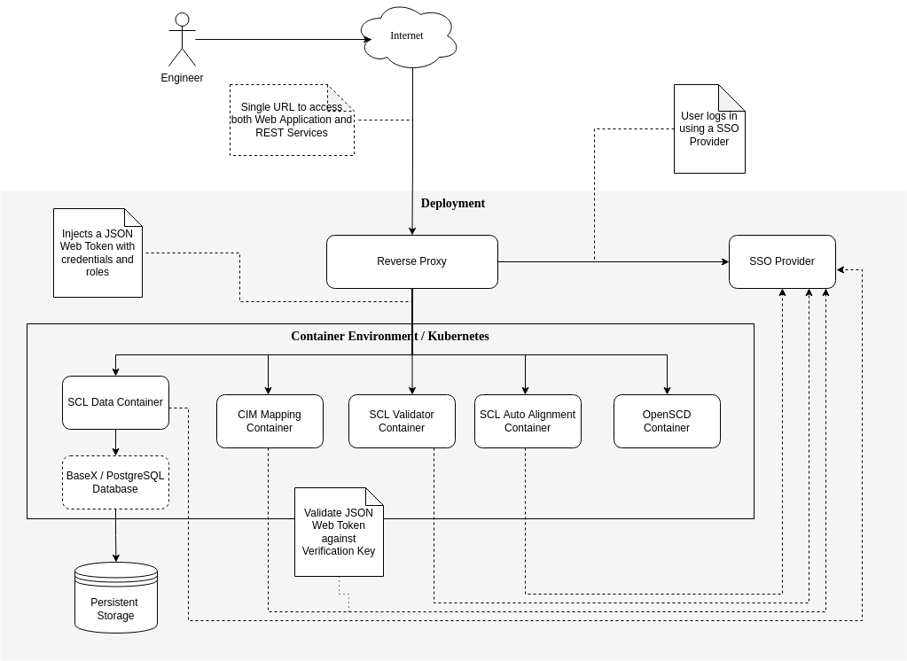

<!--
SPDX-FileCopyrightText: 2021 Alliander N.V.

SPDX-License-Identifier: Apache-2.0
-->

# Deployment View

Below is a global overview of the expected deployment of the CoMPAS Environment.

The engineer uses an internet browser to connect to the web application. The internet browser also sends
REST Calls to the different back-end services. All request are going to the same base URL, for instance 
http://localhost/ in the Docker Compose variant.

The internet browser will first go through a reverse proxy that will first validate if the engineer is logged in.
If not an SSO Provider is used log the engineer in. This SSO Provider also delivers a JSON Web Token (JWT) to be 
used by the reverse proxy.

Depending on the context root the reverse proxy send the request further to the container. The JWT is added as 
authorization header to the requests to the containers. The JWT also contains the roles the engineer has.

The container validates the JWT using a verification key. This is often an URL to the SSO Provider that returns 
a JSON Web Key (Set) (JWK/JWKS). Also it uses the configured Path to retrieve the Roles/Groups.

## Local Deployment

- **Docker Compose**: Container Environment
- **KeyCloak**: For the local deployment found in the GIT Repository we are using KeyCloak as an SSO Provider. 
  All the users and roles are configured in KeyCloak.
- **OpenResty**: As reverse proxy we are using a customized docker image of OpenResty. OpenResty verifies if the user 
  is logged in and injects the JWT it retrieved from KeyCloak to the request going to the back-end services.

## Amazon Cloud (AWS)

- **[Amazon EKS](https://aws.amazon.com/eks/)**: Container Environment?
- **[Amazon Cognito](https://aws.amazon.com/cognito/)**: SSO Provider?
- **[AWS Elastic Load Balancing](https://aws.amazon.com/elasticloadbalancing/)**: Reverse proxy?
